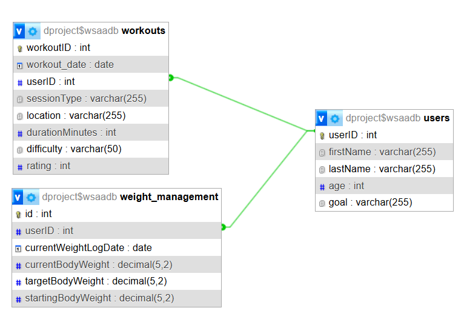

# wsaa-project
Repository for the Web Services and Application project

## 📖 Project Overview
This readme documents the WSAA project, showing the use of RESTFUL APIs using Flask. It contains a web interface which enables a user to perform CRUD operations to enter details for a workout, add a client to the client table and details to track the changes in weight of a client throughout their workout journey. 

### Project requirements
- Implement RESTful API
- Connect to at least one database table
- Perform full CRUD operations
- Web interface to interact with data

### Features Implemented
- ✔️ RESTful API for workout session data
- ✔️ Web interface with AJAX for front-end interaction
- ✔️ Full CRUD functionality
- ✔️ Multiple database tables (`users`, `workouts`, `weight_management`)
- ✔️ Online hosting via Pythonanywhere
- ✔️ UI/UX improvements

## Project Setup

### Cloning repository from GitHub

1. Copy the following URL:
https://github.com/Ange-Dvs/wsaa-project.git

2. Open CMDER or if using VS Code open the terminal pane

3. Navigate to the folder where you want to clone the repository to on your machine and type git pull
``git clone https://github.com/Ange-Dvs/wsaa-project.git``

4. Set merge as the mode for the pull
``git config pull.rebase false``

5. Initiate the pull of the GitHub repository
``git pull``

6. If the pull has been successful, you should see 6 files pulled from GitHub. The ``readme.md``, the ``.gitignore`` file, the XXX files contained within.

### Running the project
1. Ensure Python and necessary libraries are installed
  - ``requirments.txt`` can be used to install necessary libraries: 
   ``pip install -r requirements.txt``
2. Set up the database using `db_setup.sql`
3. Run the app locally:
``python server.py``

### Software used
- **Backend:** Python (Flask)
- **Frontend:** HTML, CSS, JavaScript (AJAX)
- **Database:** MySQL
- **Local Development Server:** WAMP
- **Online hosting:** Pythonanywhere

## Walkthrough of project

### Project Structure
- `dao` – folder containing all the DAO files containing the interactions with the database
- `html` – folder containing the html files for the web interface
- `sql_setup` - folder containing two SQL files. One containing the logic for creating the tables (`db_setup.sql`) and another containing command to insert some sample dummy data for testing if needed (`seed_data.sql`)
- `server.py` – Flask application
- `requirements.txt` – details of the packages used in the project
- `README.md` – project documentation
- `dbconfig.py` - config file containing details for connecting to SQL database

### Database Design
Tables: `users`, `workouts`, `weight_management`

The above shows the details and relationship between the tables. The green line indicates the keys which are linked, both workouts and weight_management have foreign key constraints with the userID within the users table. 

If a user is deleted from the users table it will delete the entries tied to that used in the other tables. This is keep the database clean and only keep data for active users. 

### DAO files
The DAO files contain the logic for interactions with the MySQL database and performing CRUD operations on the database.
The credentials for connecting to the database are imported from the ``dbconfig.py`` file. 
The SQL queries are parameterized to avoid SQL injection, which allows for the executions to be reused as needed when called, ``cursor.execute()`` fills the placeholders (represented by ``%s``) with data provided by the user in the UI.

The ``getcursor()`` method handles establishing the connection to the MySQL database, it returns a cursor object which is used for executing the SQL queries.

The ``closeAll()`` method is used to close the cursor after the SQL query is executed, preventing leaks. 

### HTML files

## Frameworks, Libraries, and Tools Used

Within the assignments various libraries are used including: 
- ``Flask``
- ``Flask-CORS``
- ``mysql-connector-python``
- ``jQuery``
- ``Bootstrap 4``
- Built-in/Standard library

<b>Flask</b>   
&nbsp;&nbsp;&nbsp;&nbsp;&nbsp;&nbsp;&nbsp;&nbsp;Flask is a lightweight WSGI web application framework used to build the backend REST API for handling requests related to users, workouts, and weight logs. It also serves static HTML pages. Used in `server.py`

The following are components are used throughout the assignments from `Flask`: 

> ``Flask()`` (Class) -  Initializes the app: ``app = Flask(...)``.[^reference]

> ``@app.route()`` (Decorator) - Defines API and HTML routes like ``/api/users``, ``/workouts``, etc..[^reference]

> ``send_from_directory()`` (Function) - Used to return HTML files stored in a folder (e.g., ``index.html``)..[^reference]

> ``jsonify()`` (Function) - Retrieves JSON data from POST/PUT requests.[^reference]

> ``abort()`` (Function) - Used to return HTTP error responses when validation fails.[^reference]

<b>Flask-CORS</b>   
&nbsp;&nbsp;&nbsp;&nbsp;&nbsp;&nbsp;&nbsp;&nbsp; This extension is used to allow Cross-Origin Resource Sharing so that the frontend (HTML + JS) can make requests to the Flask backend used in `server.py`.

The following are methods used throughout the assignments from `LIB1`: 

> ``CORS(app)`` (Function) - Enables CORS on the app instance.[^reference]

> ``@cross_origin()`` (Decorator) - Applied to individual routes to permit frontend AJAX access.[^reference]

<b>mysql-connector-python</b>   
&nbsp;&nbsp;&nbsp;&nbsp;&nbsp;&nbsp;&nbsp;&nbsp; Used for interacting with the MySQL database across all DAO files (users, workouts, weight), used in DAO files.

> ``mysql.connector.connect()`` (Function) -  Establishes a DB connection.[^reference]

> ``cursor.execute(...)`` (Method) - Executes SQL queries.[^reference]

> ``cursor.fetchall()`` / ``cursor.fetchone()`` (Method) - Retrieves query results.[^reference]

> ``db.commit()`` (Method) - Commits changes for INSERT/UPDATE/DELETE operations.[^reference]

<b>jQuery</b>   
&nbsp;&nbsp;&nbsp;&nbsp;&nbsp;&nbsp;&nbsp;&nbsp; Used in the HTML files to make asynchronous API calls and manipulate the DOM

> ``$.ajax()`` (Function) - Sends asynchronous requests to endpoints like ``/api/users``, ``/api/workouts``, etc.[^reference]

> ``$(...).val()`` (Method) - Reads/writes input field values in forms.[^reference]

> ``$(...).text()`` / ``$(...).html()`` (Method) - Updates content of HTML elements dynamically.[^reference]

> ``$(document).ready()`` (Function) - Initializes fetches like fetchAllUsers() when the page loads.[^reference]

<b>Bootstrap 4</b>   
&nbsp;&nbsp;&nbsp;&nbsp;&nbsp;&nbsp;&nbsp;&nbsp; CSS framework used for responsive and styled HTML UI components like buttons, tables and form inputs, used within all HTML files for the project. It improves  the user interface aesthetics and responsiveness without custom CSS code.

Examples:

> ``.btn``, ``.btn-primary``, ``.form-control``, ``.table``, ``.card``, ``.container``, ``.thead-dark``, etc.

<b>Python Standard Library</b>   
&nbsp;&nbsp;&nbsp;&nbsp;&nbsp;&nbsp;&nbsp;&nbsp; Used throughout the Python files for the project.

The following are methods used throughout the assignments from `LIB1`: 

> ``json `` (Module) - Serializes and deserializes JSON data.[^reference]

> ``datetime`` (Module) - Used to handle or parse dates, particularly for ``workout_date`` and ``logDate`` values within the project to ensure the dates are in the desired format of YYYY-MM-DD.[^reference]

### Template for libraries used 

<b>Library Name</b>   
&nbsp;&nbsp;&nbsp;&nbsp;&nbsp;&nbsp;&nbsp;&nbsp;Summary of library and context for project

The following are methods used throughout the assignments from `LIB1`: 

> ``.XXXX`` (Function/Method/Module/Class from `XXX` module ) - Summary and how used.[^reference]

> ``.XXXX`` (Function/Method/Module/Class from `XXX` module ) - Summary and how used.[^reference]

> ``.XXXX`` (Function/Method/Module/Class from `XXX` module ) - Summary and how used.[^reference]

> ``.XXXX`` (Function/Method/Module/Class from `XXX` module ) - Summary and how used.[^reference]

> ``.XXXX`` (Function/Method/Module/Class from `XXX` module ) - Summary and how used.[^reference]

> ``.XXXX`` (Function/Method/Module/Class from `XXX` module ) - Summary and how used.[^reference]

> ``.XXXX`` (Function/Method/Module/Class from `XXX` module ) - Summary and how used.[^reference]

> ``.XXXX`` (Function/Method/Module/Class from `XXX` module ) - Summary and how used.[^reference]

> ``.XXXX`` (Function/Method/Module/Class from `XXX` module ) - Summary and how used.[^reference]

> ``.XXXX`` (Function/Method/Module/Class from `XXX` module ) - Summary and how used.[^reference]

> ``.XXXX`` (Function/Method/Module/Class from `XXX` module ) - Summary and how used.[^reference]

> ``.XXXX`` (Function/Method/Module/Class from `XXX` module ) - Summary and how used.[^reference]

> ``.XXXX`` (Function/Method/Module/Class from `XXX` module ) - Summary and how used.[^reference]

> ``.XXXX`` (Function/Method/Module/Class from `XXX` module ) - Summary and how used.[^reference]

***
End 

**Author:**   
Angela Davis